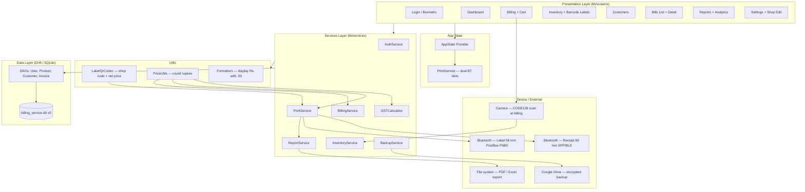
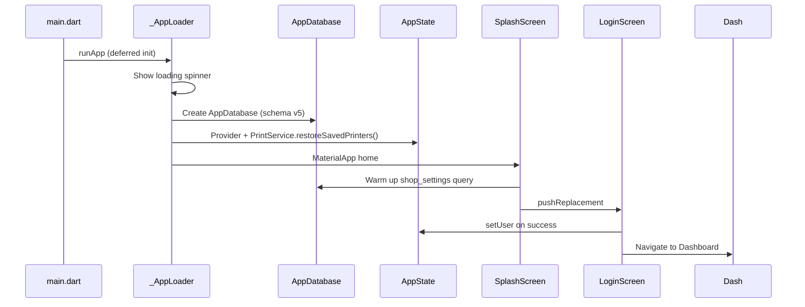
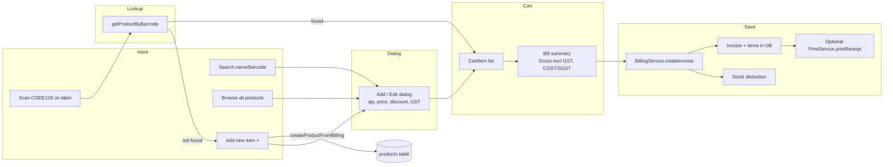
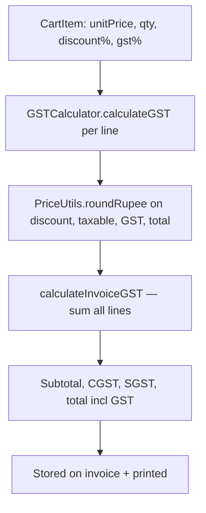
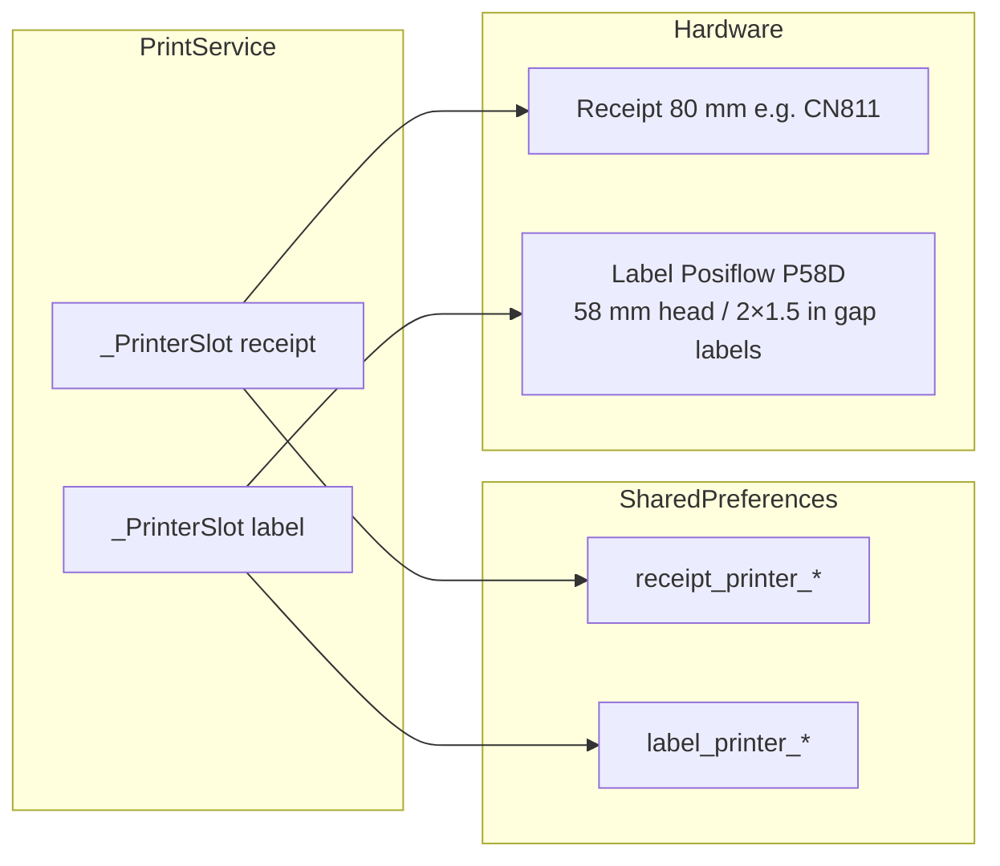
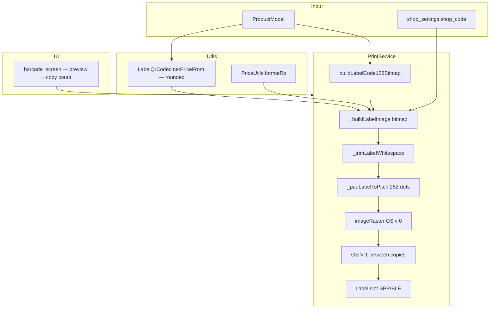
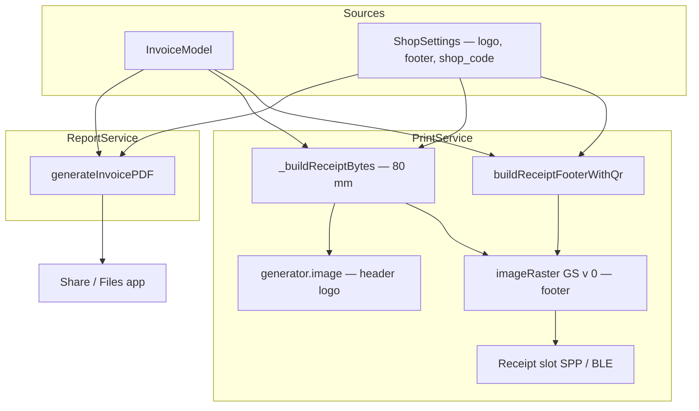
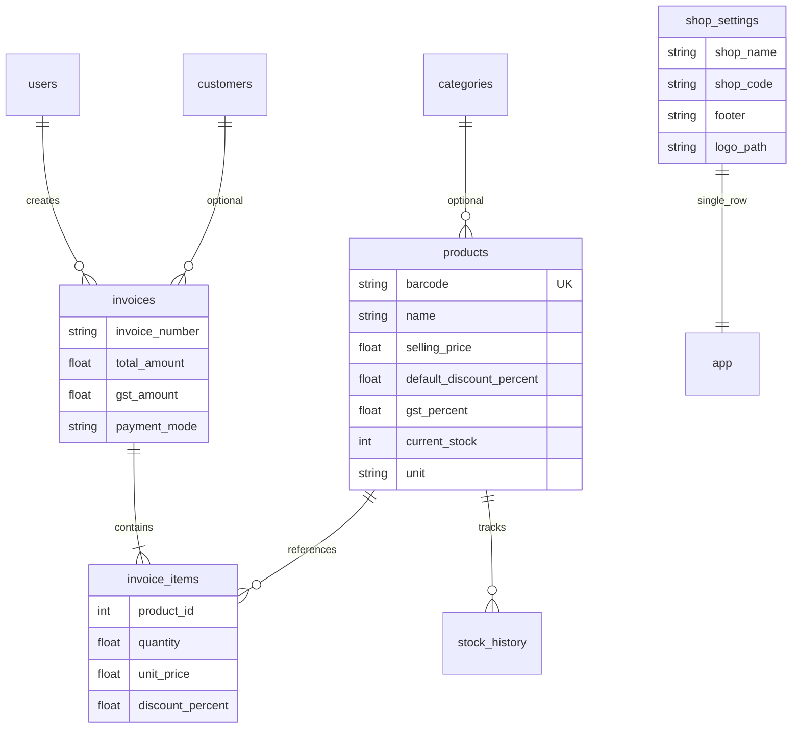
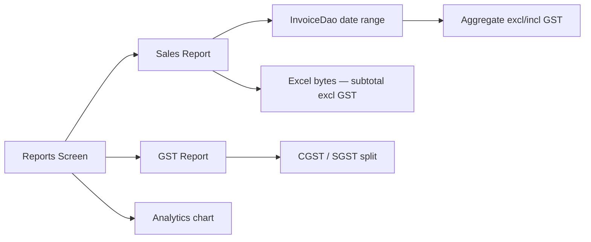
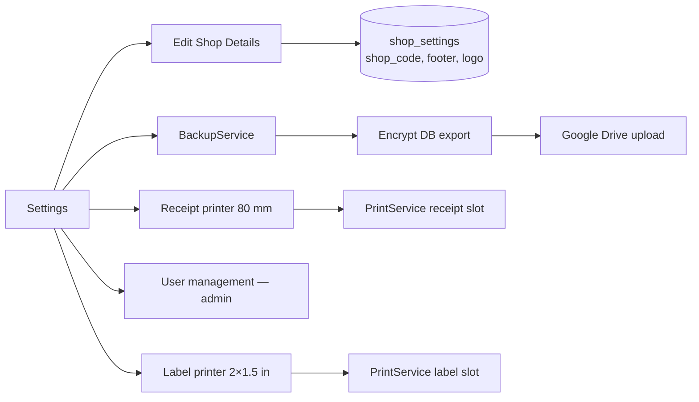

# Bill Service — Architecture & Flows

**Project:** `bill-service` · **Package:** `com.billingservice.app` · **Stack:** Flutter + Drift (SQLite) + Provider

---

## 1. High-Level Architecture



---

## 2. Application Startup Flow



---

## 3. Billing Flow (POS)



### Billing decision points

| Step | Behavior |
|------|----------|
| Scan **CODE128 on product label** | `getProductByBarcode` → add product to cart at inventory MRP + default discount |
| Scan plain barcode (inventory) | Same lookup → add dialog if needed → cart |
| Scan unknown barcode | **Add New Item** dialog → inventory + cart |
| Tap product | Add dialog (editable **price**, **discount**) |
| Tap cart price line | Edit qty / price / discount |
| Save bill | Invoice row, line items, stock −qty, optional **receipt** thermal print |

**Note:** Billing no longer parses signed label QR. The label barcode (`product.barcode`) is the scan key.

---

## 4. GST & Price Rounding



### Rounding rules (`lib/utils/price_utils.dart`)

| Rule | Implementation |
|------|----------------|
| All money values | Round to **nearest whole rupee** (`amount.round()`) |
| Display | Always show **`.00`** — e.g. `Rs.101.00`, `₹101.00` |
| Label net price | `MRP × (1 − disc%)` then round |
| Cart / receipt / PDF | Same rounding via `PriceUtils` + `Formatters.formatCurrency` |

- GST **%** comes from **product** (Inventory), not auto by price on quick-add (default **5%**).
- Line totals are **GST-inclusive**; Gross Total on bill = total − embedded GST.

---

## 5. Dual Printer Architecture

Two **independent** Bluetooth connections in `PrintService`:



| Role | `PrinterRole` | Paper | Used for |
|------|---------------|-------|----------|
| **Receipt** | `receipt` | 80 mm | Bills, test receipt, invoice QR footer |
| **Label** | `label` | 58 mm head / **2"×1.5"** gap labels | Product CODE128 labels only |

- Settings shows **two cards**: connect, test, disconnect each printer separately.
- Legacy single-printer prefs migrate to **receipt** slot on first launch.
- `isConnected` = receipt connected (backward compatible for billing print checks).

---

## 6. Label Print Pipeline (CODE128)



### Label layout (2" × 1.5" thermal)

```
MRP Rs.112.00                    -10%
        SRT PRICE Rs.101.00
        (incl. of all taxes)
        [CODE128 barcode]
        111500
        SAREE
```

| Element | Details |
|---------|---------|
| **MRP** | Left-aligned, bold, large (`arial48` or `arial24`) |
| **-10%** | Right-aligned, same font as MRP, 10px right margin |
| **SRT PRICE** | Centered, bold, same font size as MRP line |
| **Tax line** | Small (`arial14`) |
| **Barcode** | CODE128 = `product.barcode` (billing scans this) |
| **Code text** | Barcode value, bold |
| **Product name** | Uppercase, bold |

**Removed from label:** shop name header, signed QR.

### Label technical constants

| Constant | Value | Purpose |
|----------|-------|---------|
| `_labelPaperWidth` | 384 dots | 58 mm print head |
| `_labelPitchHeightDots` | 252 dots | 1.5" label face height |
| Print command | `generator.imageRaster()` | GS v 0 — no rotation |
| Multi-copy gap | `GS V 1` (`0x1D 0x56 0x01`) | Gap sensor finds next sticker |
| Top whitespace | `_trimLabelWhitespace()` | Crop blank rows above first ink |

**Do not** use `generator.cut()` for labels — it adds extra blank lines that misalign gap-sensor printers.

### Print copies (1–999)

```text
for each copy:
  print full 252-dot raster
  if not last copy → GS V 1 (gap sensor advance)
```

Each copy prints the **identical full layout** (MRP, discount, SRT PRICE, barcode, etc.).

### Label PDF / preview

- On-screen preview: aspect ratio **2 : 1.5**
- Share PDF: page size **2" × 1.5"**, same layout as thermal

---

## 7. Receipt Print & Invoice QR Pipeline



| Output | Printer | Encoding |
|--------|---------|----------|
| Receipt text | Receipt 80 mm | ESC/POS commands |
| Shop header | Receipt | Bitmap via `generator.image()` (logo + shop name) |
| **Product labels** | Label 58 mm | **GS v 0 raster** — CODE128 layout (see §6) |
| Invoice QR footer | Receipt | **GS v 0 raster** — footer text left, QR right |
| Label PDF | — | 2"×1.5" page |
| Invoice PDF | — | 80 mm thermal format + footer bitmap |

### Invoice QR payload

```text
INV:0001|SC:SRT|AMT:101.00|DT:2026-09-13
```

| Field | Key | Source |
|-------|-----|--------|
| Invoice number | `INV:` | `invoice.invoiceNumber` |
| Shop code | `SC:` | `shop_settings.shop_code` (default **SRT**) |
| Amount | `AMT:` | `PriceUtils.roundRupee(total)` with `.00` |
| Date | `DT:` | `yyyy-mm-dd` |

### Invoice QR technical notes

| Issue | Fix applied |
|-------|-------------|
| QR not scanning | Footer changed from `generator.image()` (ESC * rotates 270°) to **`imageRaster()`** |
| Quiet zone | 10px white margin around QR modules |
| QR size | 120×120 px in footer bitmap |

---

## 8. Data Model (Core Tables)



**Schema version:** 5 (adds `shop_settings.shop_code`, default `SRT` on migrate)

**DB file (Android):** `/data/data/com.billingservice.app/app_flutter/billing_service.db`

---

## 9. Reports Flow



---

## 10. Settings & Backup



**Shop Details fields:** shop name, **shop code** (used in invoice QR + label price line prefix), address, phone (optional), email, GSTIN, state code, footer, logo.

---

## 11. Module Map

```
lib/
├── main.dart                 → Deferred DB init, Provider root
├── app_state.dart            → currentUser, PrintService
├── screens/
│   ├── login/                → Auth → Dashboard
│   ├── dashboard/            → Hub navigation
│   ├── billing/              → POS, cart, CODE128 scan at billing
│   ├── inventory/            → CRUD, barcode_screen (label preview/print)
│   ├── customers/
│   ├── bills/                → list, detail, PDF, receipt print
│   ├── reports/
│   └── settings/             → shop_details_edit_screen, dual printer cards
├── services/
│   ├── billing_service.dart  → createInvoice, CartItem
│   ├── inventory_service.dart→ CRUD, createProductFromBilling
│   ├── report_service.dart   → reports, invoice PDF
│   ├── print_service.dart    → dual BT, receipt 80mm, label 2×1.5in raster
│   ├── gst_calculator.dart   → GST + PriceUtils rounding
│   └── backup_service.dart
├── database/                 → Drift tables + DAOs (schema v5)
├── models/
│   ├── printer_device.dart   → PrinterRole, PrinterConnectionType
│   └── printer_scan_result.dart
└── utils/
    ├── label_qr_codec.dart   → shop code resolve, netPriceFrom (labels)
    ├── price_utils.dart      → round rupees, formatRs, netAfterDiscount
    ├── formatters.dart       → currency display with .00
    ├── constants.dart
    └── validators.dart       → validateShopCode
```

---

## 12. Role-Based Access

| Feature | Admin | Cashier |
|---------|-------|---------|
| Billing, inventory view | Yes | Yes |
| Edit shop details (incl. shop code) | Yes | No |
| User management | Yes | No |
| Backup settings | Yes | Typically admin |

(Enforced in Settings UI; extend server-side if multi-device sync added later.)

---

## 13. Key File Reference

| Concern | Primary files |
|---------|----------------|
| Dual printers | `print_service.dart`, `settings_screen.dart`, `printer_device.dart` |
| Label bitmap + gap feed | `print_service.dart` — `_buildLabelImage`, `_padLabelToPitch`, `_feedToNextLabelGap` |
| Label net price / shop code | `label_qr_codec.dart`, `price_utils.dart` |
| Label print UI | `barcode_screen.dart` |
| Billing CODE128 scan | `product_search_widget.dart`, `billing_screen.dart` |
| Shop code setting | `shop_details_edit_screen.dart`, `shop_settings_table.dart` |
| Receipt + invoice QR | `print_service.dart` — `invoiceQrPayload`, `buildReceiptFooterWithQr` |
| Price rounding | `price_utils.dart`, `gst_calculator.dart`, `formatters.dart` |
| Invoice PDF | `report_service.dart` |

---

## 14. Hardware Setup Summary

| Device | Role | Label/stock | Connection |
|--------|------|-------------|------------|
| CN811 (or similar) | Receipt | 80 mm continuous | Settings → Receipt printer |
| Posiflow P58D | Label | **2" × 1.5"** gap labels | Settings → Label printer |

**Default login:** `admin` / `admin123`

**Build release APK:**
```bash
cd bill-service
flutter build apk --release
```

---

See also: [README.md](README.md) · [PRINTING_GUIDE.md](PRINTING_GUIDE.md) · [TESTING_GUIDE.md](TESTING_GUIDE.md) · [EMULATOR_TESTING_GUIDE.md](EMULATOR_TESTING_GUIDE.md) · [MANUAL_BILLING_GUIDE.md](MANUAL_BILLING_GUIDE.md) · [IMPLEMENTATION_STATUS.md](IMPLEMENTATION_STATUS.md) · [SETUP_INSTRUCTIONS.md](SETUP_INSTRUCTIONS.md) · [BUILD_AND_RELEASE.md](BUILD_AND_RELEASE.md) · [DATA_AND_SECURITY.md](DATA_AND_SECURITY.md)
