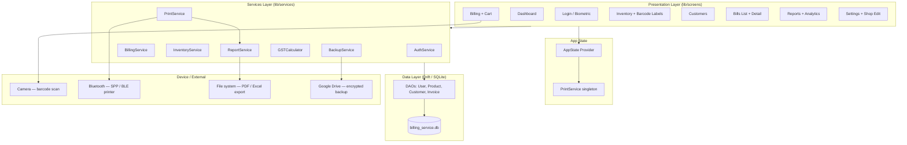
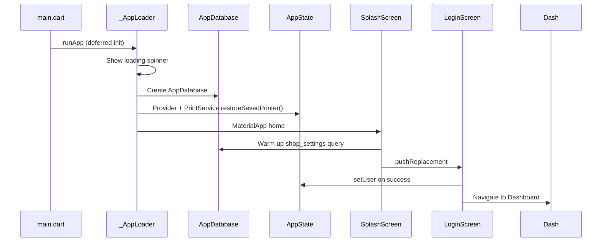
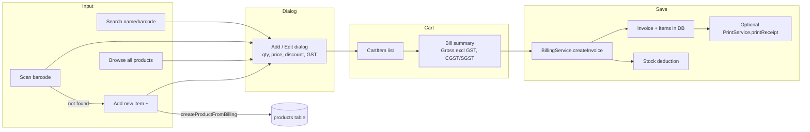
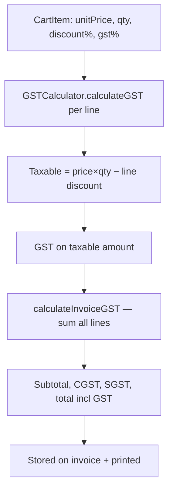
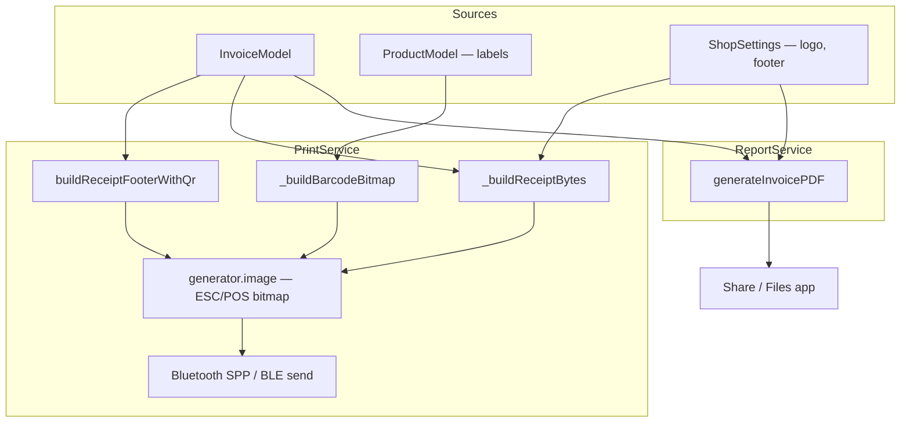
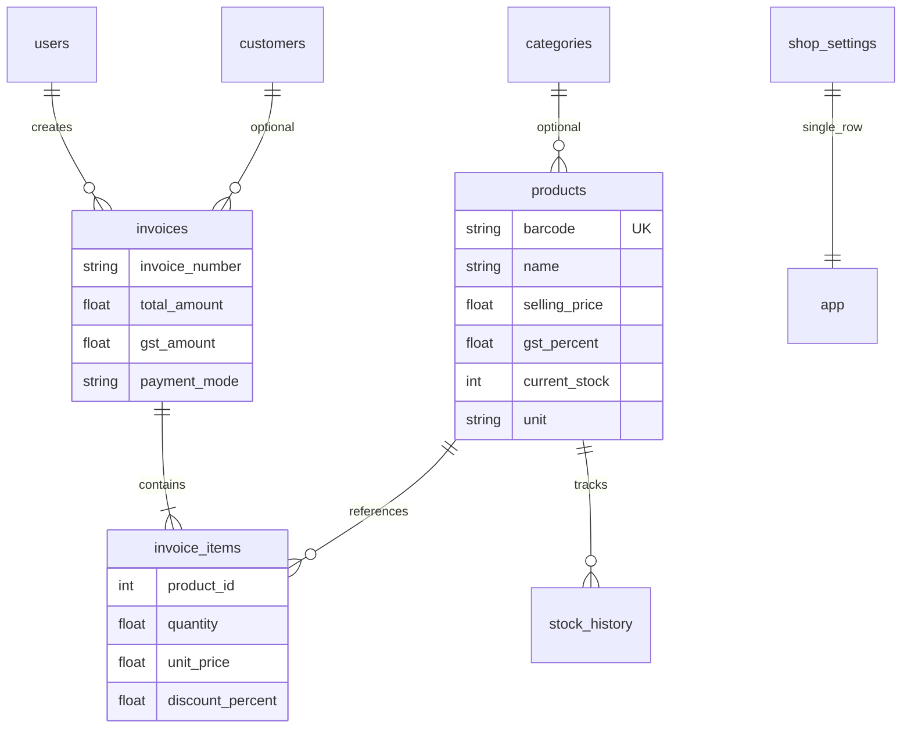
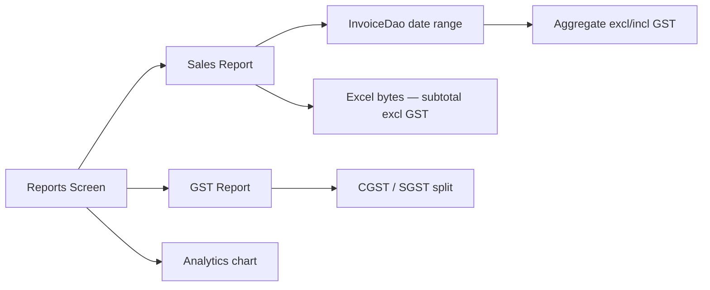
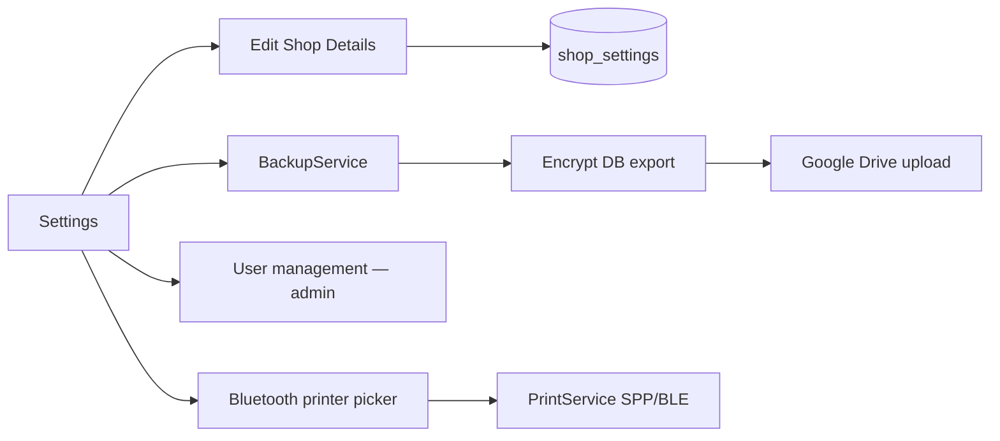

# Bill Service — Architecture & Flows

**Project:** `bill-service` · **Package:** `com.billingservice.app` · **Stack:** Flutter + Drift (SQLite) + Provider

---

## 1. High-Level Architecture



---

## 2. Application Startup Flow



---

## 3. Billing Flow (POS)



### Billing decision points

| Step | Behavior |
|------|----------|
| Scan known barcode | Lookup → add dialog → cart |
| Scan unknown barcode | **Add New Item** dialog → inventory + cart |
| Tap product | Add dialog (editable **price**, **discount**) |
| Tap cart price line | Edit qty / price / discount |
| Save bill | Invoice row, line items, stock −qty, optional thermal print |

---

## 4. GST Calculation Flow



- GST **%** comes from **product** (Inventory), not auto by price on quick-add (default **5%**).
- Line totals are **GST-inclusive**; Gross Total on bill = total − embedded GST.

---

## 5. Print & PDF Pipeline



| Output | Encoding |
|--------|----------|
| Receipt text | ESC/POS commands (esc_pos_utils_plus) |
| Shop header | Bitmap (logo + wrapped shop name) |
| Barcode labels | **Bitmap CODE128** (matches screen/PDF) |
| Invoice QR | **Bitmap** footer row — text left, QR right |
| Invoice PDF | pdf + barcode_image + shared header bitmap |

**QR payload:** `INV:<number>|AMT:<total>|DT:<yyyy-mm-dd>`

---

## 6. Data Model (Core Tables)



**DB file (Android):** `/data/data/com.billingservice.app/app_flutter/billing_service.db`

---

## 7. Reports Flow



---

## 8. Settings & Backup



---

## 9. Module Map

```
lib/
├── main.dart                 → Deferred DB init, Provider root
├── app_state.dart            → currentUser, PrintService
├── screens/
│   ├── login/                → Auth → Dashboard
│   ├── dashboard/            → Hub navigation
│   ├── billing/              → POS, cart, add_cart_item_dialog
│   ├── inventory/            → CRUD, barcode_screen
│   ├── customers/
│   ├── bills/                → list, detail, PDF, print
│   ├── reports/
│   └── settings/             → shop_details_edit_screen, printer
├── services/
│   ├── billing_service.dart  → createInvoice, CartItem
│   ├── inventory_service.dart→ CRUD, createProductFromBilling
│   ├── report_service.dart   → reports, PDF
│   ├── print_service.dart    → thermal, bitmap barcodes/QR
│   ├── gst_calculator.dart
│   ├── auth_service.dart
│   └── backup_service.dart
├── database/                 → Drift tables + DAOs
├── models/
└── utils/                    → constants, validators, formatters
```

---

## 10. Role-Based Access

| Feature | Admin | Cashier |
|---------|-------|---------|
| Billing, inventory view | Yes | Yes |
| Edit shop details | Yes | No |
| User management | Yes | No |
| Backup settings | Yes | Typically admin |

(Enforced in Settings UI; extend server-side if multi-device sync added later.)

---

See also: [IMPLEMENTATION_STATUS.md](IMPLEMENTATION_STATUS.md) · [README.md](README.md)
